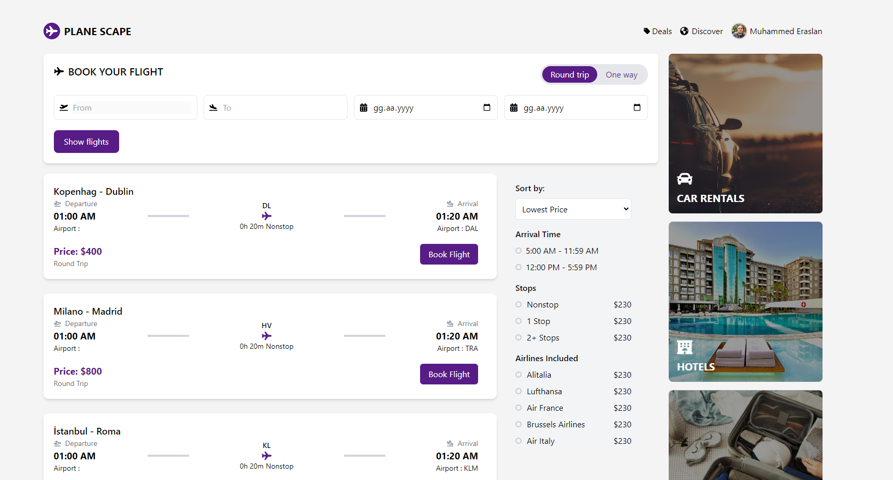
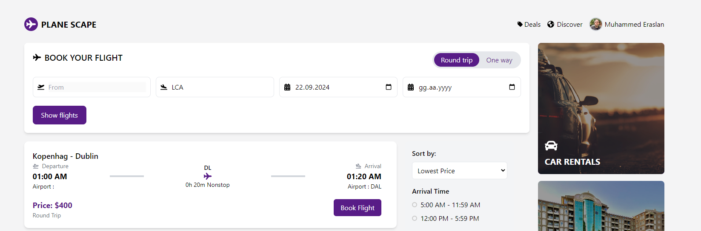
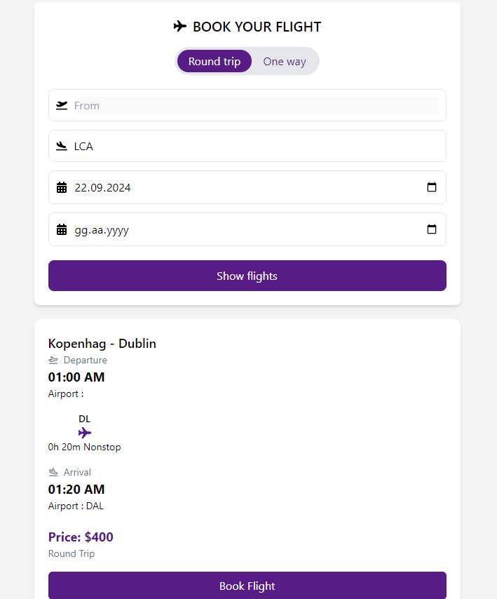
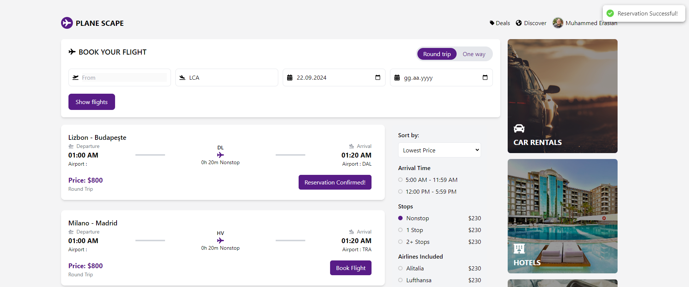
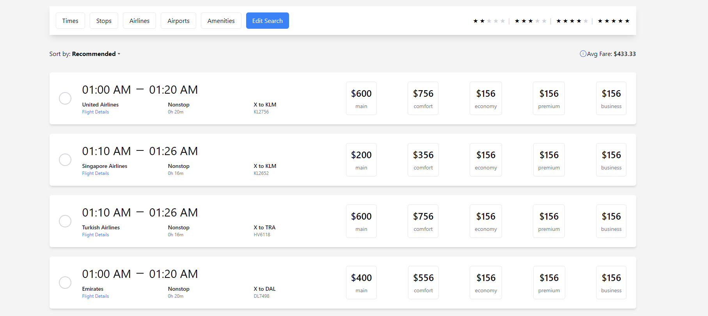
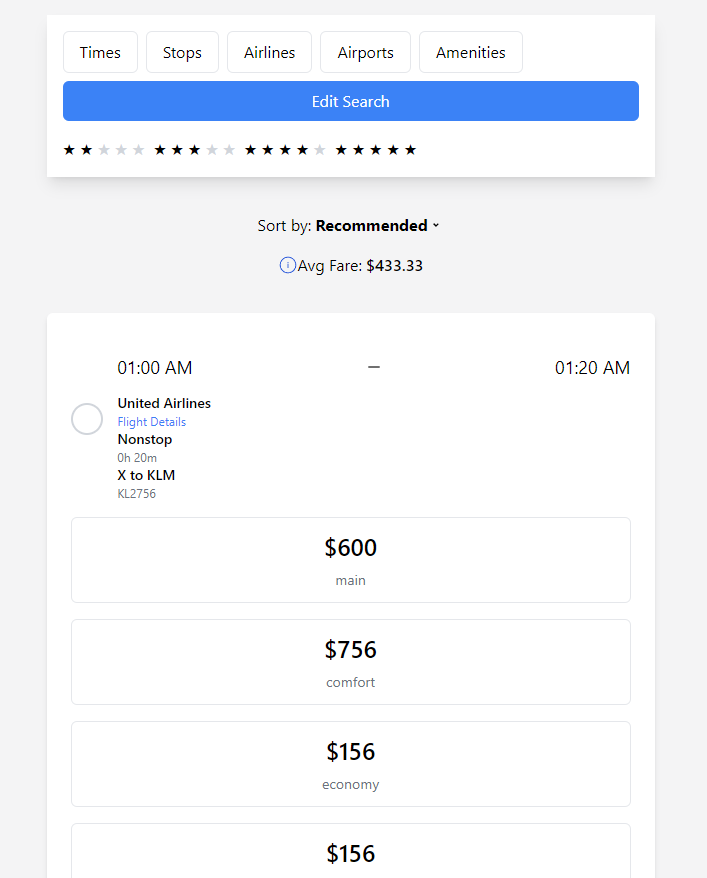

# PlaneScape - Uçuş Rezervasyon Sistemi

Bu proje, uçuş bilgilerini listeleyip kullanıcıların uçuş rezervasyonlarını yapabilmesini sağlayan bir uçuş rezervasyon sistemidir. Sistem, bir uçuş rezervasyon arayüzü, uçuş verilerini filtreleme ve sıralama, rezervasyon işlemleri ve MongoDB veritabanı entegrasyonunu içermektedir.

## Proje Görselleri









## Proje İçeriği

1. **Backend**: Express.js ve MongoDB kullanılarak uçuş verilerini yöneten bir API.
2. **Frontend**: React ile geliştirilmiş bir kullanıcı arayüzü.
3. **Veritabanı**: Uçuş verilerini saklamak için MongoDB kullanıldı.

## Özellikler

- Uçuş bilgilerini API'den çekip listeleme.
- Uçuşları `Nereden`, `Nereye` ve `Tarih` bilgilerine göre filtreleme.
- Uçuşları fiyat, varış saati, aktarma sayısı gibi kriterlere göre sıralama.
- Uçuş rezervasyonu yapma ve yapılan rezervasyonları görüntüleme.
- Yapılan rezervasyonları MongoDB veritabanına kaydetme.

## Kurulum

### Gereksinimler

- Node.js
- MongoDB
- Git

### Adımlar

1. **Projenin kopyalanması:**

   ```bash
   git clone https://github.com/Muhammedersln/Flight-Reservation-React.git
   cd Flight-Reservation-React

2. **Sunucu ve istemci bağımlılıklarının yüklenmesi**

## Backend (sunucu) için:

- cd backend
- npm install

## Frontend (istemci) için:

- cd frontend
- npm install

3. **MongoDB bağlantısı:**

MongoDB'nin çalıştığından emin olun ve backend/config dizinindeki config.js dosyasındaki MongoDB bağlantı bilgilerini ayarlayın.

mongoose.connect('mongodb://localhost:27017/FlyDB', {
  useNewUrlParser: true,
  useUnifiedTopology: true,
})
.then(() => console.log('MongoDB bağlantısı kuruldu'))
.catch(err => console.error('MongoDB bağlantı hatası:', err));

4. **Sunucunun başlatılması:**

- Backend (sunucu) için:

cd backend
npm start

- Frontend (istemci) için:

cd frontend
npm start

5. **API Anahtarları:**

backend/routes/flights.js dosyasındaki API anahtarları (APP_ID ve APP_KEY) ile FLIGHT_API_URL değerlerini uygun şekilde güncelleyin.

## KULLANIM ##

1. Ana Sayfa: Uçuş arama ve filtreleme özelliklerini kullanarak uygun uçuşları arayın.
2. Rezervasyon Yapma: Uygun uçuşları seçip Book Flight butonuna tıklayarak rezervasyon yapın.
3. Rezervasyonlarım: My Flights sayfasında yaptığınız rezervasyonları ve ortalama fiyatı görüntüleyin.